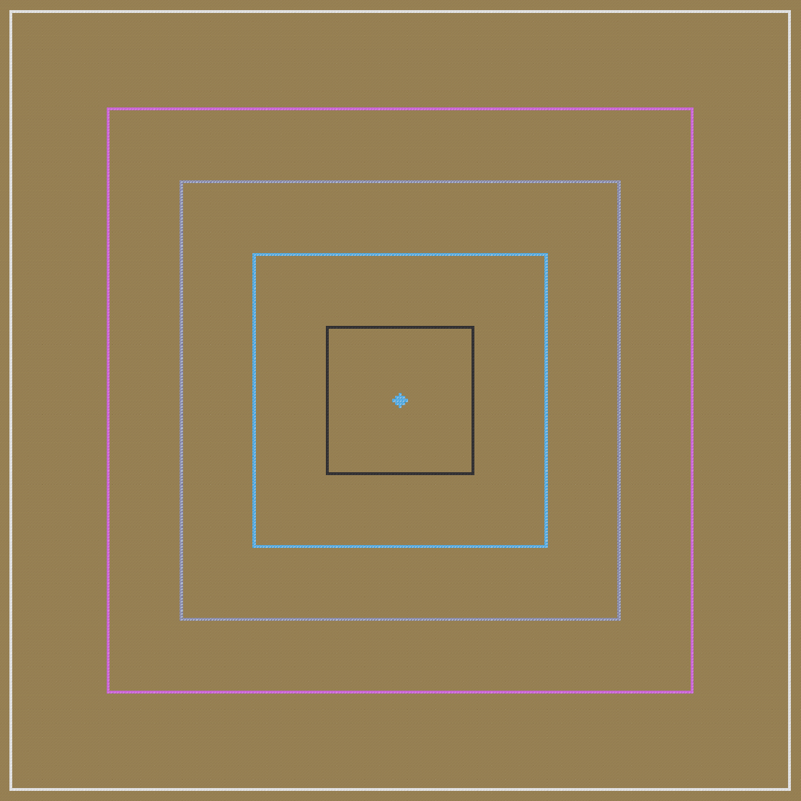

# Adding Flight Pylon Tiers

Tiers are added through [Data Maps](qhttps://docs.neoforged.net/docs/resources/server/datamaps/). File is `data/yet_another_industrialization/data_maps/block/flight_pylon_tier.json`. Use the following schema for each tier:

```
"modern_industrialization:advanced_machine_casing": {
  "range": 48.0,
  "eu": 768,
  "translation_key": "text.yet_another_industrialization.flight_pylon_tier_small",
  "beacon_color": "#3FCAFF",
}
```

- `modern_industrialization:advanced_machine_casing`: Defines what block is used as the core of the multiblock
- `range`: How far, in blocks from the pylon's center, a player can be and still receive flight from it
- `eu`: How much EU is consumed every tick
- `translation_key`: Name used in shape selection and recipe viewer
- `beacon_color`: Color used for pylon's beacon


For reference, check the ranges of all default tiers (24, 48, 72, 96 and 127 block ranges respectively):

